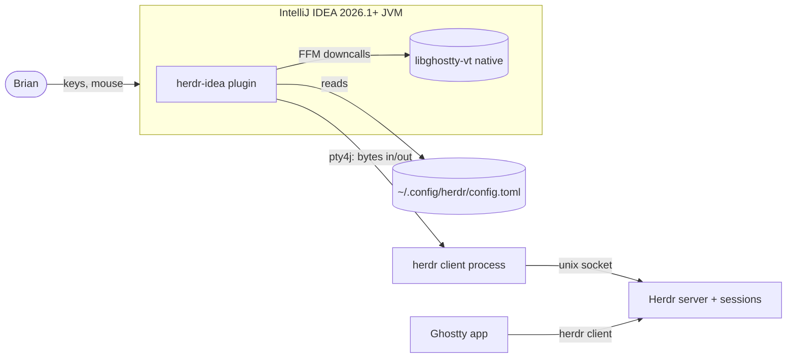
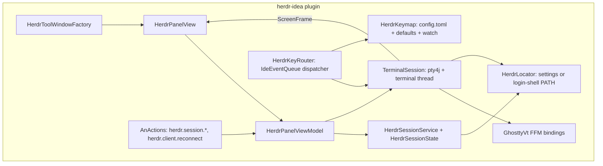
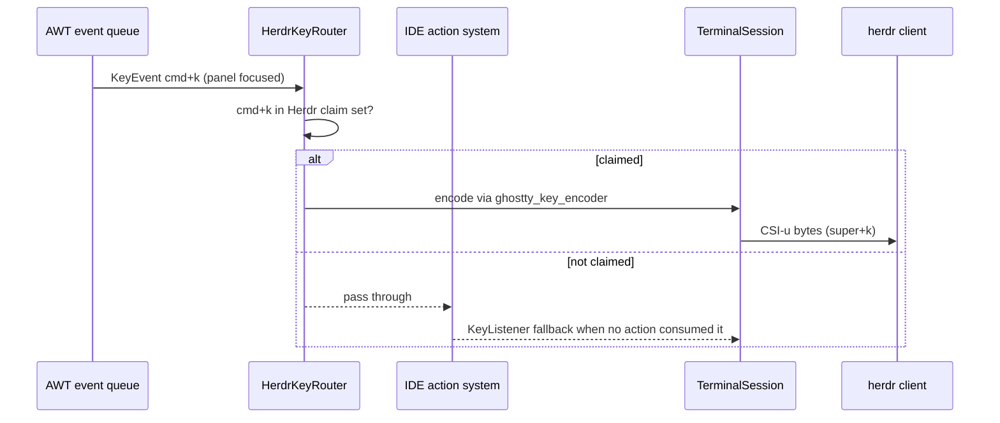

## Context

Motivation and behaviour: `proposal.md` and `specs/`. Owning intent: `/Users/codaveto/Work/intents/herdr-intellij-tool-window/herdr-intellij-tool-window.md`.

Observed facts this design rests on:

- **IDE runtime.** IntelliJ IDEA 2026.1.2 (`IU-261.24374.151`) runs on JBR 25.0.2, so Java's Foreign Function and Memory API (`java.lang.foreign`, final since Java 22) is available. The platform bundles `pty4j` and JNA in `lib/`.
- **IDE terminal.** IntelliJ's terminal on branch `261` has no Ghostty engine. Only `master` has one, behind `terminal.use.ghostty.emulator`. Its "Override IDE shortcuts" feature (`plugins/terminal/.../block/output/TerminalEventDispatcher.kt` on `261`) shows the platform's way to win keys from the action system:
  - it registers an `IdeEventQueue.EventDispatcher` while the terminal has focus;
  - it lets a small allow-list of IDE actions through;
  - it sends every other key to the pty, and uses a `KeyListener` fallback for keys the action system did not consume.
- **libghostty-vt.** Checked at Ghostty `4ae9f1a2`, 2026-09-22. It is a C API built with Zig 0.16 and provides:
  - `ghostty_terminal_*`: VT parsing and screen state;
  - `ghostty_render_state_*`: incremental render state, with row and cell iterators and a dirty-row iterator;
  - `ghostty_key_encoder_*` and `ghostty_mouse_encoder_*`, with `setopt_from_terminal` so the encoding follows the modes the running program enabled, such as the Kitty keyboard protocol and mouse tracking;
  - a paste encoder.

  It draws nothing itself, and its API is marked unstable.
- **Herdr.** Checked at `herdrdev/herdr` `621e6b73`, with 0.9.0 installed.
  - `herdr` attaches the default session; `herdr --session <name>` uses or creates a named session; `herdr session list --json` lists sessions.
  - Key grammar and defaults live in `src/config/keybinds.rs` and `src/config/model.rs`. `cmd` is the super modifier, and Herdr reads Kitty-protocol key events with super (`src/raw_input.rs`).
  - No CLI command reports the effective key table, so the plugin must read `config.toml` itself.
  - Brian's config binds `prefix = "ctrl+;"` and many `cmd+…` chords, for example `cmd+k`, `cmd+p`, `cmd+w`, `cmd+t`, `cmd+e` and `cmd+shift+k`.

Constraints: Marketplace, builds 261 and later, macOS and Linux on arm64 and x64, no dependency on the IDE's terminal plugin.

Diagram format: plain Mermaid, lightweight C4-inspired (container, component, one dynamic view).

## Goals / Non-Goals

**Goals:**
- A tool window running a real `herdr` client, emulated by libghostty-vt and drawn in Swing.
- Deterministic key precedence: Herdr's effective key set and Esc win while the panel has focus; nothing changes elsewhere.
- Shared session by default. The user can create a project session, switch between the two, and the plugin remembers the choice per project.
- One Marketplace archive carrying the four native libraries.

**Non-Goals:**
- Reading Ghostty's user config, or matching Ghostty's GPU renderer, ligatures or shaders.
- Windows support.
- Managing Herdr panes, agents or the Herdr server beyond starting clients and creating named sessions.
- A separate CLI program for the plugin. Programs outside the IDE reach the panel's named actions through the dispatcher in D7.
- Kitty graphics, sixel and images.

## Decisions

### D1. The plugin bundles libghostty-vt and calls it through FFM
The native library is built with Zig from a pinned Ghostty commit, once per target (`darwin-aarch64`, `darwin-x86_64`, `linux-x86_64`, `linux-aarch64`). It is packed into the plugin jar under `native/<os>-<arch>/`, extracted to the plugin's system directory on first use, and loaded with `SymbolLookup.libraryLookup`. The Kotlin bindings are hand-written `MethodHandle`s for the functions used.
- *Over the IDE's `master` Ghostty terminal:* that terminal does not exist on 261 or 262, and the user requires 2026.1.
- *Over JNA:* JNA is also bundled, but FFM is the JDK standard on JBR 25 and has faster downcalls. JNA stays a fallback if a platform shows an FFM defect.
- *Over jextract-generated bindings:* the used surface is small (terminal, render state, key, mouse and paste encoders), and generated code would churn with every unstable API change.

### D2. The plugin draws the screen itself in Swing from libghostty's render state
A pty reader thread feeds output into `ghostty_terminal`. After each batch it takes the render state's dirty rows, copies them into an immutable JVM `ScreenFrame` (cells, style runs, cursor), and posts a repaint. The Swing component paints only the dirty rows, using the IDE's console font (`EditorColorsManager` scheme console font and colours).
- *Over JediTerm, the IDE's classic terminal component:* JediTerm has its own emulator, so it would not be "Ghostty powered".
- *Over the IDE editor component (the new terminal's approach):* it drags in editor machinery and IDE-internal APIs, and the plugin does not need editor features.
- **Threading.** Only the terminal thread touches native handles. The EDT only reads published `ScreenFrame`s.

### D3. The pty comes from the platform's pty4j
The plugin runs the `herdr` client under pty4j with `TERM=xterm-ghostty`, falling back to `xterm-256color` when that terminfo entry is missing. The working directory is the project root. The environment is the login-shell environment, the same one used to locate `herdr`.
- **Locating `herdr`:** the plugin setting if set, otherwise `$SHELL -lc 'command -v herdr'`, so the PATH seen by apps launched from the Dock matches the shell's.

### D4. Key routing is an `IdeEventQueue.EventDispatcher` that claims a known key set
The dispatcher is active only while the panel's terminal component has focus. It claims a `KeyEvent` when the keystroke is in the claim set:
- Herdr's effective bindings: `prefix`, every `[keys]` entry and every `[[keys.command]]` `key`, merged over Herdr's built-in defaults;
- Esc;
- the prefix follow-up key while a prefix is pending.

A claimed event is encoded with `ghostty_key_encoder` and written to the pty, and the action system never sees it. Any other event is left to the platform. If no enabled action consumes it, the component's `KeyListener` encodes and sends it, as in the IDE terminal's fallback. `setFocusTraversalKeysEnabled(false)` keeps Tab in the terminal.
- *Over "claim every key":* the user chose Herdr's bound keys only.
- *Over the IDE terminal's allow-list approach:* the set of claimed keys comes from Herdr's config, so key precedence is a pure function of the Herdr config.
- **`cmd` on macOS** maps to AWT `META`, and to the super modifier for the encoder. On Linux, `cmd` in Herdr config maps to the Super key.

### D5. The plugin parses Herdr's config.toml with Herdr's grammar
`HerdrKeymap` parses `config.toml` (TOML via `org.tomlj:tomlj`). Its key-string grammar ports `src/config/keybinds.rs` at the pinned Herdr version, covering tokens such as `prefix+…`, `ctrl+;`, `backtick`, `minus` and arrow names. Defaults are ported from `src/config/model.rs`.
- **Config path:** `$XDG_CONFIG_HOME/herdr/config.toml`, else `~/.config/herdr/config.toml`.
- **Reload:** a VFS or `WatchService` watch rebuilds the claim set when the file changes (spec: config changes apply without restart).
- A key string the parser does not understand is logged and skipped. The rest of the keymap stays active.

### D6. Sessions are plain Herdr sessions, chosen per project
`HerdrSessionState` is a project-level `PersistentStateComponent` holding the chosen target: `shared` or `project`.
- **Project session name:** `idea-<project-name-slug>-<6-char hash of project base path>`, with the slug cut so the whole name stays within Herdr's rule (`src/session.rs`: ASCII letters, digits, `.`, `_`, `-`; at most 64 bytes; not `.` or `..`). The name is stable per project and distinct for two projects with the same name.
- **Create:** launch `herdr --session <name>` with cwd set to the project root.
- **Switch:** end the current client and start a client on the other target.
- **Existence check:** before attaching to a remembered project session, the plugin runs `herdr session list --json`, which drives the "session no longer exists" state.
- The plugin only starts and ends clients. It never runs `herdr session stop` or `delete` and never stops the server.

### D7. Named actions live in one registry; the view model owns state
The panel follows the MVVM split of `our-dev-conventions`:
- `HerdrPanelView` is the Swing component and header.
- `HerdrPanelViewModel` publishes `PanelState`: `Connecting`, `Live(session)`, `Exited(code)`, `HerdrMissing(searched)`, `SessionMissing(name)` and `UnsupportedPlatform`.
- `HerdrPanelViewService`, a project service that lives as long as the project, holds the registry from action name to handler. The view model forwards intents to it and holds no handler body.
- `HerdrClient` owns the running client and publishes the panel state and screen frames; the view service's handlers drive it.

Every interaction has one name and one handler in that registry:
- Panel interactions: `herdr.session.newProject`, `herdr.session.switchShared`, `herdr.session.switchProject`, `herdr.client.reconnect`, `herdr.settings.open` and `herdr.panel.show`.
- Capture and read-out: `herdr.panel.capture` writes a PNG of the panel to a given path; `herdr.panel.read` answers the panel state, session, size, cursor and screen text as JSON.

Three routes reach the same handler:
- the panel's own controls, through the view model;
- a registered `AnAction` per panel interaction with the same id, so it works from Find Action and the panel header without a mounted screen;
- the dispatcher: a `RestService` on the IDE's built-in server, `POST http://localhost:<port>/api/herdr?action=<name>&project=<name>&<arg>=<value>`. It listens on localhost only and runs as the user who runs the IDE, so a caller reaches nothing that user cannot. Acceptance runs use it to act, capture and read without clicking.
- *Over IDE actions only:* Brian chose outside access so agents can prove the panel without screen automation.

### D8. Build, verification and release
- **Build:** Gradle with the IntelliJ Platform Gradle Plugin 2.x. `sinceBuild = 261` with no `untilBuild`. The Plugin Verifier runs against 261 and the latest available build.
- **Native libraries:** one Linux CI job cross-compiles the four libraries with Zig, then assembles one plugin zip and publishes it with `publishPlugin`.
- **Checks:** checks and builds run on the VPS through Crabbox (`.crabbox.yaml`, per `remote-checks`), except the steps that need a macOS host or a GUI IDE.

## Risks / Trade-offs

- [libghostty-vt API breaks between Ghostty commits] -> Pin one Ghostty commit per plugin release. Bindings live in one file. Bumping the pin is a deliberate task with a render and key smoke test.
- [Zig cross-compilation to macOS may need Apple SDK pieces] -> Build the macOS targets on macOS runners. libghostty-vt uses no Apple frameworks, so a Linux cross-build may work; verify during the build task.
- [Herdr changes its key grammar or defaults] -> The port is pinned to a Herdr version and covered by unit tests over Brian's real config. An unparseable key is skipped and logged, never fatal.
- [Claiming Herdr keys hides IDE shortcuts, for example `cmd+w` and `cmd+e`] -> Only while the panel has focus, and exactly as the user asked. Keys leave the claim set as soon as Herdr unbinds them.
- [Swing text painting is slower than Ghostty's GPU renderer] -> Paint only dirty rows, cache glyph runs per style, and coalesce repaints to the display refresh. Herdr redraws are bounded by the panel size.
- [Wide-character and emoji width mismatches between libghostty and Java fonts] -> Cell widths come from libghostty (`unicode` utilities). Glyphs are drawn into their cell box with fallback fonts from the IDE's font preferences.
- [Dock-launched IDE lacks the shell PATH] -> The login-shell lookup (D3) and the settings override.
- [`xterm-ghostty` terminfo missing on Linux] -> Fall back to `xterm-256color`. Herdr enables its features by querying the terminal, so the Kitty keyboard protocol still negotiates through libghostty's responses.

## Migration Plan

New plugin; nothing to migrate. Release flow: tag, CI builds natives and plugin, Plugin Verifier passes, publish to Marketplace. Rollback: hide or revert the Marketplace version. Herdr sessions are unaffected by plugin removal.

## Resolved Questions

- The Ghostty commit pinned for the first release is `4ae9f1a2de5484de3d6a13fe03676b8853b9c41c`. It builds with Zig 0.16 (0.15 is rejected by its build) and cross-compiles all four targets from one macOS host, so darwin targets need no macOS runner.
